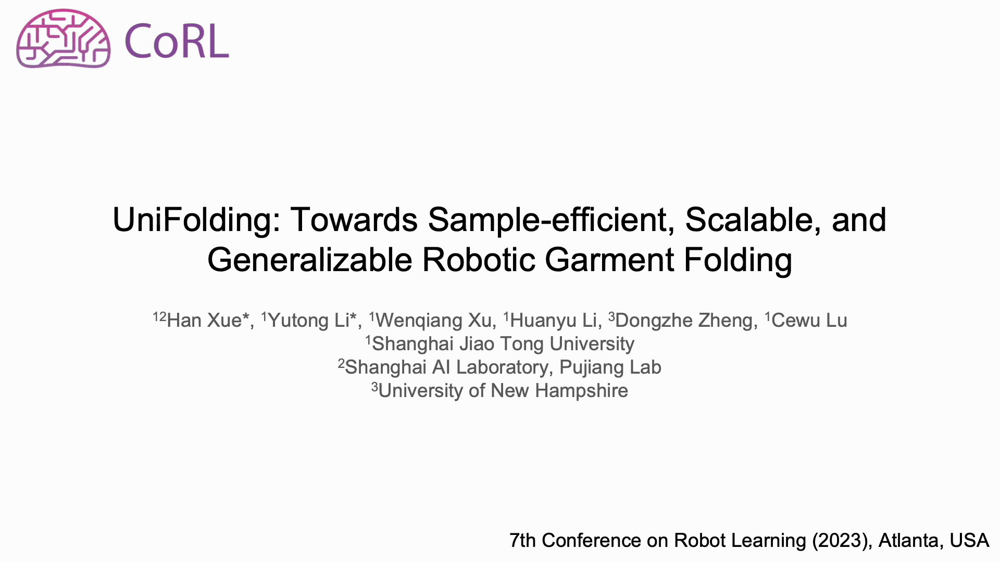

# 👔 UniFolding

[](https://arxiv.org/abs/2311.01267) [](https://unifolding.robotflow.ai)


This repo contains official code for the CoRL 2023 paper: [UniFolding: Towards Sample-efficient, Scalable, and Generalizable Robotic Garment Folding](https://unifolding.robotflow.ai/). *UniFolding* is a sample-efficient, scalable, and generalizable robotic system for unfolding and folding various garments with large variations in shapes, textures and materials.

-  Paper: [UniFolding: Towards Sample-efficient, Scalable, and Generalizable Robotic Garment Folding](https://arxiv.org/abs/2311.01267)
-  Website: [https://unifolding.robotflow.ai](https://unifolding.robotflow.ai)
## Introduction
### Challenges

### Method & Advantages

### Experiments

## ⚙Environment Setup

This section describes how to setup neccessary environments for this project.

### 🧠 Learning Environment

The learning code should work on environments that meet the following requirements

- Modern Linux Distributions that are not in EOL.
- Python >= 3.8
- Pytorch >= 1.11.0
- CUDA >= 11.3

We recommend these combinations:

- Ubuntu 20.04
- Python = 3.8
- Pytorch = 1.11.0
- CUDA = 11.3

To setup the learning environment, you need to download and install CUDA from [here](https://developer.nvidia.com/cuda-downloads) in advance. Then, you should run the `setup-env.sh` script to setup all basic requirments except for GroundedSAM.


```bash
bash scripts/shell/setup-env.sh
```

This script will automatically create an conda environment named `unifolding` and install dependent packages in it. You can modify this script to make it behaves differently.

Finally, see [GroundedSAM](https://github.com/IDEA-Research/Grounded-Segment-Anything) for installation of Grounded-DINO and Segment-Anything.

### 🔽 Pre-trained Models
Please download the pre-trained models for long-sleeve Shirts and short-sleeve T-shirts from [here](https://drive.google.com/file/d/1qjoBzYUOgj9ldJ00lIIpg5Fjr0YIglXL/view?usp=sharing). 

### 💻 Simulation Environment

The simulation environment depends on [RFUniverse](https://github.com/mvig-robotflow/rfuniverse). To setup the simulation environment, please follow the [official guide](https://docs.robotflow.ai/pyrfuniverse/markdown/get_started.htmll).

[CLOTH3D](https://github.com/hbertiche/CLOTH3D) dataset is used in our simulation. You can download it from [here](https://chalearnlap.cvc.uab.cat/dataset/38/description/).

### 📷🦾🗒 Real Environment

#### 📷Camera

Our project should work on any commercial depth cameras systems that produce colorful point cloud and RGB images. However, for the best performance, we recommend high-precision and high-resolution depth cameras. In our experiment, we adopted [Photoneo MotionCam3D M+](https://www.photoneo.com/products/motioncam-3d-m-plus/) as the main depth camera and [MindVision SUA202GC](https://www.mindvision.com.cn/uploadfiles/2020/03/18/09027801885830704.pdf) as the subordinate color camera. However, if you are using custom cameras, please re-implement `capture_pcd()` method in [manipulation.experiment_real::ExperimentReal](./manipulation/experiment_real.py).

#### 🦾Robot

Our experiments are conducted using two [Flexiv Rizon 4](https://www.flexiv.cn/en/product/rizon) robot arms. To operate these robot arms, you should install Flexiv RDK from [here](https://rdk.flexiv.com/en/). If you are using custom robot arms, please re-implement `execute_action()` method in [manipulation.experiment_real::ExperimentReal](./manipulation/experiment_real.py).
#### 🗒OMPL Setup

Open Motion Plannig Library (OMPL) is a widely-adopted library for motion plannig. We use this library to plan trajectories for the dual Flexiv arm setup. OMPL can be installed from [here](https://ompl.kavrakilab.org/download.html).

## 📕 Usage Example
Here is an minimum example of using our model. The `Inference3D` class is an interface of our AI model (UFONet), it can work seamlessly for both virtual environments (`ExperimentVirtual`) and real environments (`ExperimentReal`). You can simply modify the experiment settings by overriding config parameters with [Hydra](https://hydra.cc/). 

```python
import hydra
from omegaconf import DictConfig

from learning.inference_3d import Inference3D
from manipulation.experiment_real import ExperimentReal
from manipulation.experiment_virtual import ExperimentVirtual


@hydra.main(
    config_path="config/real_experiment", config_name="experiment_real_tshirt_long", version_base="1.1"
)
def main(cfg: DictConfig) -> None:
    # create experiment instance that contains robot controller, camera, environment setup, etc.
    exp = ExperimentReal(config=cfg.experiment)
    # exp = ExperimentVirtual(config=cfg.experiment)  # uncomment this line to use virtual environment

    # the interface of AI model (UFONet)
    inference = Inference3D(experiment=exp, **cfg.inference)

    # capture point cloud
    obs, err = exp.capture_pcd()  # please re-implement this method if you are using custom hardware

    # predict action type
    action_type = inference.predict_raw_action_type(obs)

    # predict action
    prediction_message, action_message, err = inference.predict_action(obs, action_type)

    # execute action
    err = exp.execute_action(action_message)  # please re-implement this method if you are using custom hardware


if __name__ == "__main__":
    main()
```

## 🌎 Inference

We have made a Makefile target to run the full inference process (`unfolding` + `folding`) in the real world.
```bash
make stage3.real.tshirt_long.test
```

## ⏳ Training Pipeline

The training pipeline includes 4 stages. Stage 1-3 are wrapped as Makefie targets.

#### Stage 0 (VR Data Collection)
The VR data recording system used in our paper is based on the [VR-Garment ](https://github.com/xiaoxiaoxh/VR-Garment) project. Please follow its instructions for the hardware setup and guidelines to collect human demonstration data in Virtual Reality.


#### Stage 1 (Supervised Training)
```bash
make stage1.virtual.tshirt_long.train
```

#### Stage 2 (Data Collection + Self-Supervised Training)
```bash
make stage2.virtual.tshirt_long.run
```

#### Stage 3 (Data Collection + Hybrid Training)
```bash
make stage3.real.tshirt_long.run &
make stage3.virtual.tshirt_long.run
```

> ⚠The two Makefile targets should run simutaneously.


## 🙏 Acknowlegement

- The baseline model used in our code is adapted from [ClothFunnels](https://github.com/real-stanford/cloth-funnels).


## 🏷️ License

This project is freely available for non-commercial use, and may be redistributed under these conditions. For commercial queries, please drop an e-mail at xiaoxiaoxh[at]sjtu[dot]edu[dot]cn and cc lucewu[at]sjtu[dot]edu[dot]cn. We will send the detail agreement to you.


## 🔗Citation
If you find this project helpful for your research, please consider citing the following BibTeX entry.

```BibTex
@inproceedings{xue2023unifolding,
  title={UniFolding: Towards Sample-efficient, Scalable, and Generalizable Robotic Garment Folding},
  author={Xue, Han and Li, Yutong and Xu, Wenqiang and Zheng, Dongzhe and Lu, Cewu},
  booktitle={7th Annual Conference on Robot Learning},
  year={2023}
}
```
