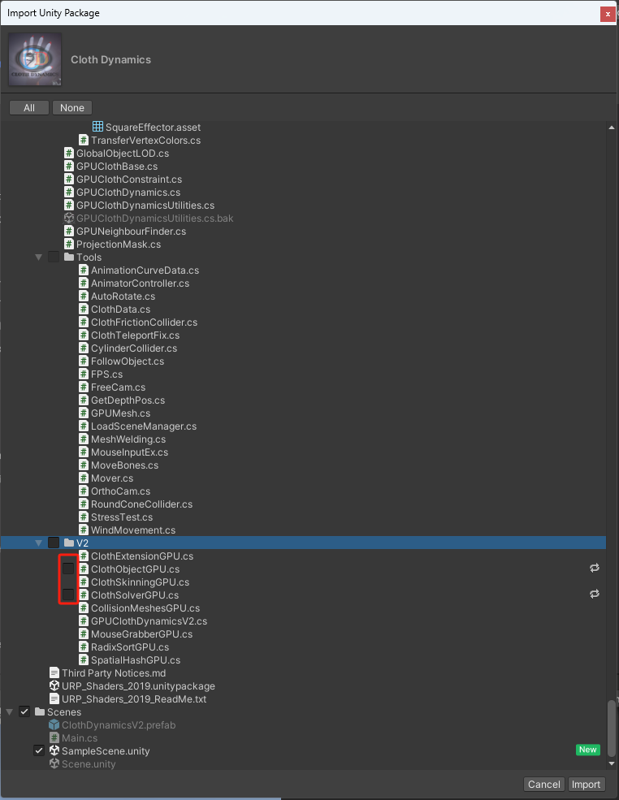
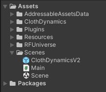
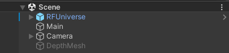
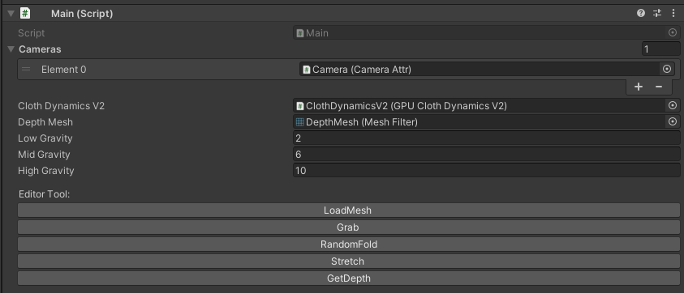

# Cloth Simulation Environment

This is the cloth simulation environment used in [UniFolding](https://github.com/xiaoxiaoxh/UniFolding).
It is built on [RFUniverse](https://github.com/mvig-robotflow/rfuniverse) which is a a platform developed in Unity for robot simulation and reinforcement learning.
The GPU-based cloth simulator in this project is based on [Cloth Dynamics](https://assetstore.unity.com/packages/tools/physics/cloth-dynamics-194408) plugin in Unity Asset Store.


## Requirements

### Supported Operating System
- Windows 11 with WSL2
- Ubuntu 20.04 (recommended)

## Setup

1. Clone Project.
   
   ```
   git clone https://github.com/xiaoxiaoxh/UniFolding
   ```

2. Install Unity Hub and install Unity Editor **2022.3 LTS** through Unity Hub.
   
   [Install the Unity Hub | Unity Hub | 3.0](https://docs.unity3d.com/hub/manual/InstallHub.html#install-hub-linux)
   
   You can install it according to the official documentation: 
   
   [Downloading and installing Editors and modules with the Unity Hub | Unity Hub | 3.0](https://docs.unity3d.com/hub/manual/InstallEditors.html)

3. Add and Open Project (`RFUniverse`) in Unity Editor.

4. The ClothDynamics plugin is used in the project for clothing simulation. Since it is a paid plug-in, you need to purchase it and import it into the project.
   
   Unity Asset Store Link：[Cloth Dynamics | Unity Asset Store](https://assetstore.unity.com/packages/tools/physics/cloth-dynamics-194408)
   
   The version that has been verified and used in the project is **2.0.9 beta**.
   
   When importing, **do not replace existing scripts** with the same name in the project. Because there are some modifications.
   
   

---

## Minimal Example

1. Open And Play `RFUniverse/Assets/Scenes/Scene.unity`
   
   

2. Select the `Main`object in the scene
   
   

3. Click the LoadMesh button to load clothes.
   
   Click the RandomFold button to random folding.
   
   

###### Preview:


---

## Build executable program

Follow the normal process to build an executable program. You can follow the official documentation:

[Unity - Manual: Publishing Builds](https://docs.unity3d.com/Manual/PublishingBuilds.html)

This executable program supports two-way messaging with the python interface ([pyrfuniverse](https://github.com/mvig-robotflow/pyrfuniverse)). 

## Customization
Currently, we have implemented some basic primitives (e.g. `fling`) in `Main.cs`. If you want to implement your own action primitives, please refer
to the documentation of [`dynamic message`](https://mvig-robotflow.github.io/pyrfuniverse/markdown/advanced_usages.html#dynamic-message).
